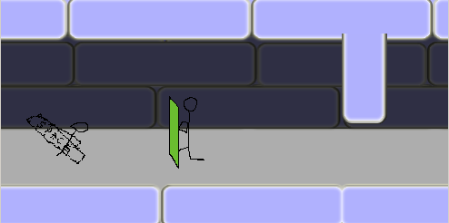
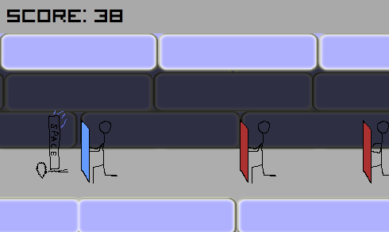

# LD42
### [Ludum Dare Compo #42. Theme: "Running out of space"](https://ldjam.com/events/ludum-dare/42)
*source* - game that I submit

*sourceFirstIdea* - fruitless attempt. I cant made normal sidescrolling and bullet shoots.

#### THEME
S.P.A.C.E., inc. steal all SPACES from keyboards. They build SPACEship with more free SPACE inside it. But, unfortunely, they took you with your SPACE too. Arm with SPACE and slash all S.P.A.C.E. minions!

#### GOAL
Run as long as you can

#### HOW TO PLAY 
 * *Spacebar* - attack
 * *W* - jump
 * *S* - roll

### OTHER
-----
#### LINK TO GAME ENTRY
https://ldjam.com/events/ludum-dare/42/s-p-a-c-e-inc

#### TOOLS USED
 * Visual Studio 2017
 * Photoshop CS2
 * Aseprite
 * Paint
 * sfxr
 
#### Made with
 * C#, WPF
 * [WpfAnimatedGif](https://github.com/XamlAnimatedGif/WpfAnimatedGif)
 
#### SCREENSHOTS
 
 
